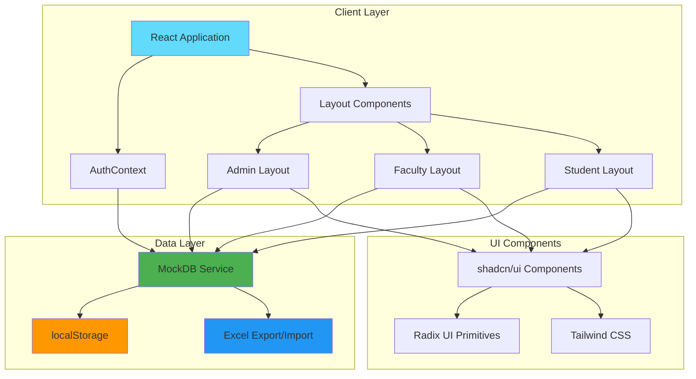
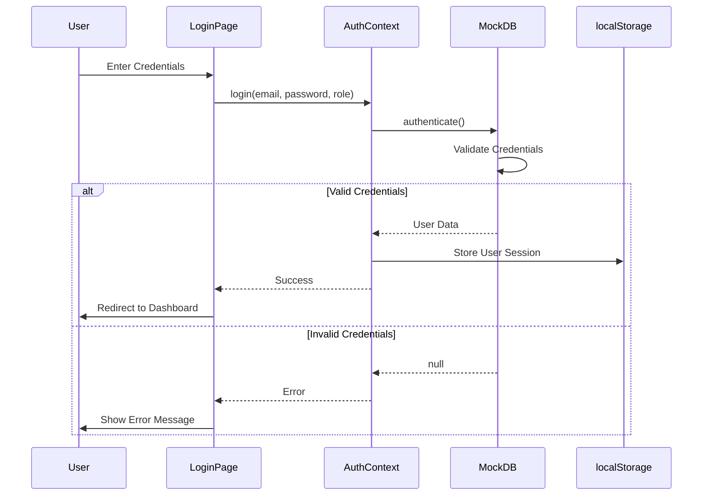
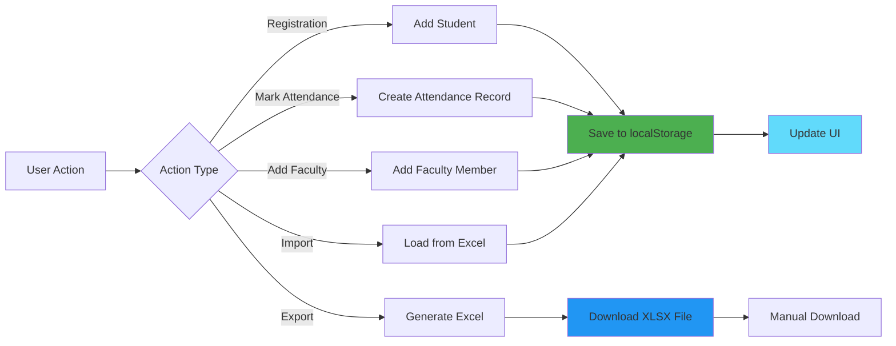
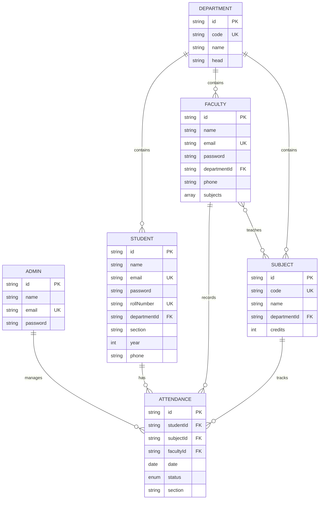
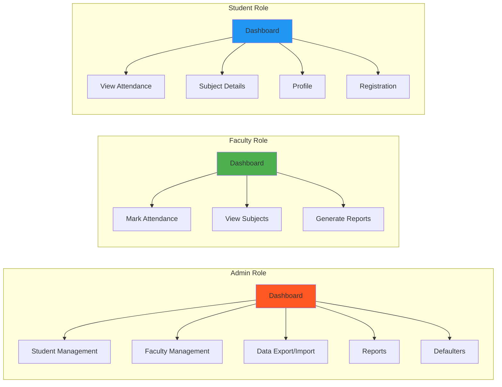
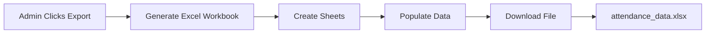
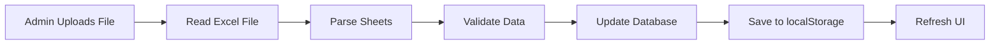

# 📊 Attendance Monitor System

<div align="center">


**A modern, full-featured attendance management system for educational institutions**

[Features](#-features) • [Tech Stack](#-tech-stack) • [Installation](#-installation) • [Usage](#-usage) • [Architecture](#-architecture)

</div>

---

## 📋 Table of Contents

- [Overview](#-overview)
- [Features](#-features)
- [Tech Stack](#-tech-stack)
- [Architecture](#-architecture)
- [Installation](#-installation)
- [Usage](#-usage)
- [Project Structure](#-project-structure)
- [Data Management](#-data-management)
- [Contributing](#-contributing)
- [License](#-license)

---

## 🎯 Overview

Attendance Monitor is a comprehensive web-based attendance management system designed for educational institutions. It provides role-based access control for **Administrators**, **Faculty**, and **Students**, enabling efficient tracking and management of student attendance across multiple subjects, departments, and sections.

### Key Highlights

- ✅ **Role-Based Access Control** - Secure authentication for Admin, Faculty, and Students
- ✅ **Real-Time Analytics** - Dynamic charts and statistics for attendance tracking
- ✅ **Excel Integration** - Import/Export functionality for data portability
- ✅ **Modern UI/UX** - Built with shadcn/ui and Tailwind CSS
- ✅ **Type-Safe** - Full TypeScript implementation
- ✅ **Responsive Design** - Works seamlessly on all devices

---

## ✨ Features

### 👨‍💼 Admin Features
- **Dashboard Analytics** - Overview of attendance statistics, defaulters, and trends
- **Student Management** - View and manage all student records
- **Faculty Management** - Add, edit, and delete faculty members with subject assignments
- **Data Export/Import** - Excel file support for backup and restore
- **Defaulters Tracking** - Identify students with attendance below threshold
- **Reports Generation** - Comprehensive attendance reports

### 👨‍🏫 Faculty Features
- **Mark Attendance** - Record attendance by date, subject, and section
- **Subject Management** - View assigned subjects
- **Attendance Reports** - Generate subject-wise and section-wise reports
- **Quick Actions** - Bulk mark present/absent for entire sections

### 👨‍🎓 Student Features
- **Personal Dashboard** - View individual attendance statistics
- **Subject-wise Breakdown** - Detailed attendance per subject
- **Visual Analytics** - Charts and graphs for attendance trends
- **Attendance Warnings** - Alerts for low attendance
- **Profile Management** - View and update personal information
- **Registration** - Self-registration with validation

---

## 🛠 Tech Stack

### Frontend Framework
- **React** `^18.3.1` - UI library
- **TypeScript** `^5.8.3` - Type safety
- **Vite** `^5.4.19` - Build tool and dev server

### UI Libraries
- **shadcn/ui** - Accessible component library
- **Radix UI** - Headless UI primitives
- **Tailwind CSS** `^3.4.17` - Utility-first CSS framework
- **Lucide React** `^0.462.0` - Icon library

### State Management & Routing
- **React Router DOM** `^6.30.1` - Client-side routing
- **React Context API** - Global state management
- **TanStack Query** `^5.83.0` - Server state management

### Data Visualization
- **Recharts** `^3.2.0` - Chart library for React

### Form Handling
- **React Hook Form** `^7.61.1` - Form state management
- **Zod** `^3.25.76` - Schema validation
- **@hookform/resolvers** `^3.10.0` - Form validation resolvers

### Utilities
- **date-fns** `^3.6.0` - Date manipulation
- **xlsx** `^0.18.5` - Excel file handling
- **clsx** `^2.1.1` - Conditional classnames
- **tailwind-merge** `^2.6.0` - Tailwind class merging

### Development Tools
- **ESLint** `^9.32.0` - Code linting
- **TypeScript ESLint** `^8.38.0` - TypeScript linting
- **PostCSS** `^8.5.6` - CSS processing
- **Autoprefixer** `^10.4.21` - CSS vendor prefixing

---

## 🏗 Architecture

### System Architecture



### Authentication Flow



### Data Flow



### Database Schema



### User Roles & Permissions



---

## 🚀 Installation

### Prerequisites

- **Node.js** `>=18.0.0`
- **npm** `>=9.0.0` or **yarn** `>=1.22.0` or **pnpm** `>=8.0.0`

### Step-by-Step Setup

1. **Clone the repository**
   ```bash
   git clone https://github.com/yourusername/attendance-monitor.git
   cd attendance-monitor
   ```

2. **Install dependencies**
   ```bash
   npm install
   # or
   yarn install
   # or
   pnpm install
   ```

3. **Start development server**
   ```bash
   npm run dev
   # or
   yarn dev
   # or
   pnpm dev
   ```

4. **Open in browser**
   ```
   http://localhost:8080
   ```

### Build for Production

```bash
# Production build
npm run build

# Preview production build
npm run preview
```

---

## 📖 Usage

### Default Credentials

#### Admin
- **Email:** `admin@university.edu`
- **Password:** `admin123`

#### Faculty
- **Email:** `alex.thompson@university.edu`
- **Password:** `faculty123`

#### Student
- **Email:** `john.smith@student.university.edu`
- **Password:** `student123`

### Admin Workflow

1. **Login** as Admin
2. **Manage Faculty**
   - Navigate to "Manage Faculty" tab
   - Click "Add Faculty" to add new teachers
   - Assign subjects and departments
   - Edit or delete existing faculty
3. **Export Data**
   - Go to "Data Management" tab
   - Click "Download Excel File"
   - File downloads as `attendance_data.xlsx`
4. **Import Data**
   - Go to "Data Management" tab
   - Click "Import from Excel"
   - Select your Excel file
   - Data imports and updates system

### Faculty Workflow

1. **Login** as Faculty
2. **Mark Attendance**
   - Select date, subject, and section
   - Mark students as present/absent
   - Save attendance records
3. **View Reports**
   - Access attendance reports
   - Download subject-wise reports

### Student Workflow

1. **Register** (New Students)
   - Click "Register" tab
   - Fill in personal details
   - Select department and section
   - Create account
2. **Login** (Existing Students)
   - Enter email and password
   - View attendance dashboard
   - Check subject-wise attendance
   - Monitor attendance warnings

---

## 📁 Project Structure

```
attendance-monitor/
├── public/                 # Static assets
│   ├── favicon.ico
│   └── robots.txt
├── src/
│   ├── assets/            # Images and media
│   ├── components/        # React components
│   │   ├── auth/         # Authentication components
│   │   │   └── LoginPage.tsx
│   │   ├── layouts/     # Role-specific layouts
│   │   │   ├── AdminLayout.tsx
│   │   │   ├── FacultyLayout.tsx
│   │   │   └── StudentLayout.tsx
│   │   ├── ui/          # shadcn/ui components
│   │   └── Layout.tsx   # Main layout router
│   ├── contexts/        # React contexts
│   │   └── AuthContext.tsx
│   ├── hooks/          # Custom React hooks
│   │   ├── use-toast.ts
│   │   └── use-mobile.tsx
│   ├── lib/           # Utilities and services
│   │   ├── mockDb.ts  # Database service
│   │   └── utils.ts   # Helper functions
│   ├── pages/         # Page components
│   │   ├── Index.tsx
│   │   └── NotFound.tsx
│   ├── App.tsx       # Main app component
│   ├── main.tsx      # Application entry point
│   └── index.css     # Global styles
├── .gitignore
├── components.json   # shadcn/ui config
├── eslint.config.js # ESLint configuration
├── index.html       # HTML template
├── package.json     # Dependencies
├── postcss.config.js # PostCSS config
├── tailwind.config.ts # Tailwind config
├── tsconfig.json    # TypeScript config
├── tsconfig.app.json
├── tsconfig.node.json
└── vite.config.ts   # Vite configuration
```

---

## 💾 Data Management

### Storage

- **Primary Storage:** Browser `localStorage`
- **Backup/Export:** Excel files (`.xlsx`)
- **File Name:** `attendance_data.xlsx`

### Excel File Structure

The exported Excel file contains the following sheets:

1. **Students** - Student records with credentials
2. **Faculty** - Faculty records with credentials
3. **Admins** - Admin records with credentials
4. **Departments** - Department information
5. **Subjects** - Subject details
6. **Attendance** - Attendance records

### Data Export/Import

#### Export Process


#### Import Process


---

## 🎨 UI Components

Built with **shadcn/ui** - A collection of re-usable components built with Radix UI and Tailwind CSS:

- Buttons, Cards, Dialogs
- Forms, Inputs, Selects
- Tables, Badges, Tabs
- Charts, Progress bars
- Toast notifications
- Alert dialogs

---

## 🔒 Security Features

- **Role-Based Access Control** - Users can only access features for their role
- **Password Protection** - Secure password storage (in-memory)
- **Session Management** - localStorage-based session persistence
- **Input Validation** - Form validation with Zod schemas
- **Email Uniqueness** - Prevents duplicate registrations

---

## 🧪 Development

### Available Scripts

```bash
# Development server
npm run dev

# Production build
npm run build

# Build for development
npm run build:dev

# Preview production build
npm run preview

# Lint code
npm run lint
```

### Code Style

- **ESLint** for code linting
- **TypeScript** for type checking
- **Prettier** (recommended) for code formatting

---

## 🤝 Contributing

Contributions are welcome! Please follow these steps:

1. Fork the repository
2. Create a feature branch (`git checkout -b feature/amazing-feature`)
3. Commit your changes (`git commit -m 'Add some amazing feature'`)
4. Push to the branch (`git push origin feature/amazing-feature`)
5. Open a Pull Request

### Development Guidelines

- Follow TypeScript best practices
- Use meaningful variable and function names
- Add comments for complex logic
- Update documentation for new features
- Write tests for new functionality

---

## 📝 License

This project is licensed under the MIT License - see the [LICENSE](LICENSE) file for details.

---

## 🙏 Acknowledgments

- [shadcn/ui](https://ui.shadcn.com/) - Beautiful UI components
- [Radix UI](https://www.radix-ui.com/) - Accessible component primitives
- [Recharts](https://recharts.org/) - Chart library
- [Vite](https://vitejs.dev/) - Next generation frontend tooling
- [Tailwind CSS](https://tailwindcss.com/) - Utility-first CSS framework

---

## 📞 Support

For support, email jakkuharshavardhan2004@gmail.com or open an issue in the GitHub repository.

---

<div align="center">

**Made with ❤️ using React, TypeScript, and modern web technologies**

⭐ Star this repo if you find it helpful!

</div>
